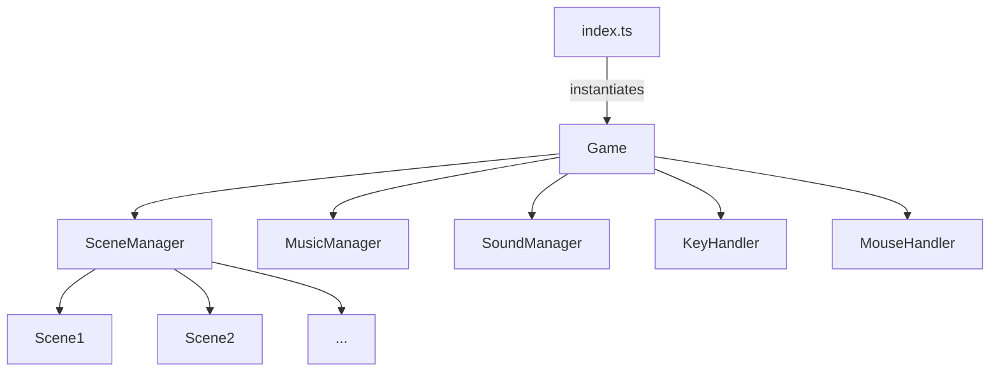

# tsgamelib - The Typescript Game Development Framework

This project attempts to make game development using Typescript & the HTML Canvas API as straightforward as possible. It provides solutions for many of the fundamental problems you're faced with when developing a game, without taking away too much control.

This README aims to exmplain the framework's fundamental concepts and features, 
starting from a high level. I'm assuming basic familiarity with JavaScript/TypeScript.
Experience with game development in particular is not required, as I'll do my best to
clarify the differences between the concepts used here and typical web development.

Also note that the provided `cheatCheet.md` file is meant for developers who are actively
working on a game using tsgamelib. It contains the most fundamental rules and heuristics
in much more concise form than this rather extensive README.

## How to Run

Requirements:
- node installed
- npm installed
- repository checked out locally (master branch)

Steps for local development:
- inside local repository run `npm install`
- run `npm start`
- open http://localhost:3000/ in your browser

You'll then see the small example game that comes with the framework. Any changes to the code files should
automatically propagate to the browser window and force the page to reload.

If you want to build for production instead of running locally, run `npm run build`.

## Concepts

tsgamelib builds on a number of proven concepts to streamline the creation of video games.
The key concepts are:

- **main loop** with draw and update cycle
- **scene system** to allow separation of concerns between different parts of the game
- standardized **media loading** pipeline to ensure all required media is loaded initially and available when needed
- **keyboard & mouse state** can be queried at any time from within the main loop, rather than listening to events
- **time system** to allow scene dependent time, different speeds, framerate independence and pausing

Furthermore, some widely required features are provided as well. These are not so integral to
the framework, but rather specific classes provided on top, that can make your life easier
while creating almost any video. Those features include include:

- bitmap fonts
- simple spritesheet support
- music manager
- sound manager (TODO)
- transitions

## Main Loop

Classic web development is pretty event driven: we execute logic upon pageload, and maybe
in certain intervals, but mostly in reaction to user actions, such as clicking links or
buttons, or typing in text.

In game development things are different: Our main driver here is not user interaction
(although that too plays a very important role of course), but the game "lives" whether
the user is doing anything or not: we have a main loop. With every screen refresh, we
go through quite a number of steps, most notably **updating our game** state and **rendering to the screen**.

The main loop ensures that all this happens. Initializing the main loop is almost the first
thing that is done (even before the loading screen: the loading screen is just a Scene that
lives "within" the main loop), and it will live on forever as long as the browser tab
is open. When the game is paused, the main loop is still running. Loading screen, pausing,
Scene transitions, the actual game - they're all merely *behaviors emerging from the main loop*
rather than *outside* the main loop.

As indicated before, the main loop is split into two parts: updating and rendering.
This is reflected by most classes of the framework (and most notably the Scenes) having
an **update** and a **draw** method. These methods almost always have the same signature:

```typescript
public update(dt: number, time: number): void {
    // ...
}

public draw(ctx: CanvasRenderingContext2D, time: number, dt: number): void {
    // ...
}
```

The concrete meaning of `dt` and `time` will be explained later, in the section on timing.
But on a very high level, `dt` is the "time delta" since the last frame, and `time` is
the total lifetime of the game (or a particular Scene we're in).

The most important aspect to this is that updates to the data model should ideally happen
within the update methods, whereas rendering should happen in the draw method and always
draw to the provided canvas context.

## Scene System

The Game class upon its own creation instantiates a SceneManager, which is a singleton-ish
class that handles the dynamics between a number of predefined Scenes. These particular
Scenes are not part of the framework, but depend on the Game's implementation.

What is a Scene? Ultimately it's not a strictly defined concept, but the basic idea is that
any specific "screen" of your game should be its own scene. Also there shouldn't be too much
redudancy of logic between scenes. A simple game could for instance have the following
different scenes:
- Loading screen
- Main menu
- Credits
- Game scene
- Pause scene

If your main menu has several sub menus, it's up to you to decide whether the whole menu
should be a single Scene, or whether each individual menu should be one Scene.
The latter would provide the benefit that you get relatively nice transitions between
your sub menus for free, which otherwise would need to be programmed explicitly as
part of the single MenuScene.

Similarly, if your Game itself consists of several stages, it can both make sense to have
one big and complex GameScene handling it all, or different Scenes for each part of the game.

Inheritance can also be useful, if Scenes have a lot in common. In a previous game I worked on
there happened to be a lot of minigames embedded into the game itself. These were all
separate Scenes, given they had very distinct logic, but they also had a lot in common,
so there was an abstract `MinigameScene`, extended by about 8 concrete scenes, one for each of
the minigames we had built.

What are the advantages of having scenes?
- Separation of concerns: your logic lives within the scene and affects nothing else
- Scenes can load their own media
- Transition between scenes is made very easy
- Keyboard & Mouse input is automatically disabled when your scene loses focus
- Scenes have their own time scope
- Less explicit game state you have to worry about (e.g. no `gameWon` variables and such, but you can simply invoke the `VictoryScene` instead)

### Scene Lifecycle Hooks

Every scene comes with the following lifecycle methods which you can implement in order to define their behavior:
- onStart - called whenever a Scene that was inactive begins to fade in
- onFadedIn - called when fade in is done and Scene is fully in focus
- onFadeOut - called when Scene is about to lose focus and begins to fade out
- onEnd - called when fade out is done and Scene has fully lost focus
- update(dt, time) - called every frame when Scene is visible
- draw(ctx, time, dt) - called every frame when Scene is visible

## Media Loading

In web applications, media (such as images and videos, maybe sound as well) can more or less
load whenever. We simply reference them in the DOM or JavaScript code, and the browser
deals with the rest. When they're loaded they'll appear, and beforehand the page might
just look a bit empty or display placeholders, no big deal.

For video games, things are a bit different. You really don't want to start the game's
scripted epic intro sequence before the main character's sprite has loaded. And if
the player shoots their gun and no sound appears, it feels like a bug. Hence it is
important for games to have control over the loading of media. Usually, everything needed
(at least for any particular level or so) should be loaded upfront. Ideally with a nice
loading bar.

This can be easily achieved in tsgamelib using the `@loadMedia` class decorator and the
static `load` method:

```typescript
@loadMedia
export default class PlayerCharacter {
    ...
    public static load(loader: Loader): void {
        this.characterSprite = loader.loadImage('/assets/sprites/character.png');
    }
    ...
    public draw(ctx: CanvasRenderingContext2D): void {
        // We can be sure that characterSprite is loaded at this point
        ctx.drawImage(PlayerCharacter.characterSprite, 0, 0);
    }
}
```

## Keyboard & Mouse Handling

Where in web development we tend to listen to keyboard and mouse events and only react
to specific happenings (such as clicks or key strokes), in our main loop driven game
environment that's often not the best way to do things. What we want instead is to simply
query the *current* state of any key (or the mouse) within our update methods.

For this, tsgamelib provides a KeyHandler and a MouseHandler. These handlers constantly
observe the keyboard and mouse, listen to all relevant events, and then can let you know
at any time whether any particular key is currently pressed or not.

While there is only one *real* KeyHandler and MouseHandler respectively, Scenes (and
their descendants) should always use their own `getKeyHandler` and `getMouseHandler`
methods. The reason for this is that, when a Scene is out of focus, these methods
instead return a dummy handler that reports no user interactions whatsoever. This
way you never have to even think about whether a scene is in focus or not, as
interactions will automatically be disabled in that case.

A simple example of how a scene might use these handlers:

```typescript
export default class GameScene {
    ...
    public update(dt: number, time: number): void {
        const keyHandler = this.getKeyHandler();
        // Move player to the right constantly when D key is hold down
        if (keyHandler.get("D")) { // <---
            this.player.move(1);
        }
        // Pause game when ESC is newly pressed
        if (keyHandler.getDown("ESC")) { // <---
            this.fadeTo("PauseScene");
        }
    }

    public draw(ctx: CanvasRenderingContext2D, time: number): void {
        // Draw player
        this.player.draw(ctx, time);
        // Draw crosshair next to mouse
        const [x, y] = this.getMouseHandler().getScreenPos(); // <---
        ctx.drawImage(GameScene.crosshairImage, x, y);
    }
}
```

## Time System

In web development, `Date.now()` is often sufficient to get the current time. When
it comes to games however, this is not a great solution for a number of reasons:
- a game might run at different speeds on different machines, so system time and game time can diverge (we'll cover framerate independence below)
- adding features such as slow motion to the game will be difficult if things are tightly coupled to system time
- it would be complicated to combine system time with a pause state in the game
- sometimes Scenes are cancelled without expecting it, which can lead to bugs in case they had created timeouts or intervals that trigger afterwards

There's a simple solution to all this: just use the internal time system.
This can be achieved in several ways:
- all draw and update methods tend to get `time` provided, which is usually a time in seconds, in the relevant context (e.g. the current Scene), which starts at 0. This is usually the one to use.
- Scenes provide a `getTime()` method returning the Scene time in seconds
- Game provides both `getAppTime()` and `getGameTime()`, which are usually identical (game time can, in principle, be sped up or slowed down however, which can e.g. be helpful for testing things quickly)

If you don't know which time to use, then just use the one from the Scene your code belongs to.
If your code doesn't belong to any Scene, than you're probably doing something wrong. If your
code somehow is used by multiple different scenes, then maybe the game time may indeed be
the right one, but it really depends on the concrete case.

### How to Ensure Framerate Independence

Short answer: Multiply everything with `dt`.

Long answer: We don't know under which circumstances our game will be executed. Slow PC,
fast PC? Lots of stuff running in the background? What's the refresh rate of the monitor?

Your game may run at 10 FPS on some old malware ridden laptop, or at 144 FPS on a high-end
setup. Obviously the game logic should not run 14x faster on the latter than on the former.

To make sure things run at roughly the same speed everywhere, there are two schools of thought:
1. `dt` multiplication (where "dt" means "delta time", or the time elapsed since the last update call)
2. Fixed number of updates per second

Option 2 is simpler and more predictable. Option 1 enables a smoother experience and may
have slight speed advantages on old machines. tsgamelib goes for option 1, although
switching to the other method would only be a matter of changing a few lines in `Game.ts`.

So what does "multiply things with `dt`" mean? Basically, any gradual change, such as
movement of characters, progress in animations, acceleration (e.g. gravity) etc. should
never be directly applied, but always be scaled down using `dt`. An example:

```typescript
const GRAVITY = 9.81;

export default class Player {
    ...
    public update(dt: number, time: number) {
        // Gravity
        this.vy += dt * GRAVITY;
        // Movement
        this.x += dt * this.vx;
        this.y += dt * this.vy;
    }
}
```

`dt` is always the time elapsed since the last update call. That means that over the course
of a second, all `dt`s that went into any particular update call will amount to 1.
Consequently in above example the player's y velocity (`vy`) would increase by 9.81 every
second, independent of the framerate. Just as on Earth.

Note that for anything depending on `time`, all is good and no `dt` multiplication is needed.
That is because `time` is the absolute time and it is nothing else than the sum of all previous
`dt` values. E.g. for something that is constantly rotating (such as a crosshair or some
other UI element) you could write `const rotation = ROTATION_SPEED * time`. Whenever you
*gradually change* something, multiply that change with `dt`. When you compute some
absolute value based on `time`, no `dt` required.

Additional note: Rarely there are cases where this is not sufficient. Say you want to apply
friction to a character, and multiply the x velocity by some factor, maybe so that it halves
every second. Something like `this.vx *= 0.5 // somehow per second?`. If my math is correct
this should be possible too, in this case by using `dt` as an exponent rather than a factor:

```typescript
public update(dt: number, time: number) {
    // Friction
    this.vx *= (0.5 ** dt); // value will be cut in half every second
}
```

This may potentially be less precise though. I'm speculating here however. If you run into
such a situation *and* really high precision is needed, maybe consult a mathematician. :)
### Timeouts & Intervals

That's all nice and well, but sometimes you really just want something to happen *5 seconds from now* instead of instantly, and just keeping track of these time values manually and checking
against them every frame doesn't sound too appealing.

Luckily, the `Scene` class got you covered: `setTimeout`, `setInterval`, `clearTimeout`
are all provided, and so is `clearAllTimeouts`. On top of that it's even a little fancier
than regular timeouts and intervals:
- `setInterval` takes an optional `maxCount` parameter, if you know the number of intervals beforehand
- if your interval callback returns `'REMOVE'`, the interval will be cancelled immediately

**Note**: Other than window timeoues/intervals, these ones use seconds rather than ms.

Using these, all the problems we would have with regular window timeouts/intervals are resolved. So use them
whenever you really need them. Non-Scene timeouts & intervals are a major source of hard to track down bugs,
so avoid them whenever possible (which should be always).

Simple example:

```typescript
class MainMenuScene extends Scene {
    private backgroundColor: string;
    public constructor() {
        super('MainMenuScene');
    }
    public onStart() {
        // Change this scene's background color every 15 seconds
        this.setInterval(this.changeBackgroundColor, 15)
    }
    public changeBackgroundColor() {
        this.backgroundColor = getRandomItem(['red', 'green', 'blue', 'yellow', 'black']);
    }
    public draw(ctx: CanvasRenderingContext2D) {
        ctx.fillStyle = this.backgroundColor;
        ctx.fillRect(0, 0, ctx.canvas.width, ctx.canvas.height);
        ...
    }
}
```

Additional note: be aware that timeouts are not the only way to do things. Sometimes it may
yield nicer code if you just store some time in a variable, and compare against it regularly.
Heavily depends on the concrete case though. 


## Class Structure

On a high level, the Game class is the root of everything. It is instantiated from index.ts.
This Game class belongs to the framework itself, so it should *not* contain any actual concrete
game code. Instead, the concrete game implementation will happen through specific Scenes and
their inner workings. So is the name `Game` a bit suboptimal? Maybe, feel free to propose a
better one. `Main`? `MainLoop`? `Core`? I don't know.



Scenes are aware of their SceneManager and have access to the Game instance as well, although
it should only rarely be necessary to involve those, as the Scene class provides a number of
getters, methods and lifecycle hooks that should be sufficient for most purposes.

Note that Scenes also have their own `getKeyHandler` and `getMouseHandler` methods, which
can differ from the Game's KeyHandler / MouseHandler instances: a Scene *only* gets access
to these proper handlers if it has focus. Scenes that are not in focus on the other hand
will return dummy handlers that report no user interaction. This ensures that user input
is always directed to one scene only and the game doesn't behave in unexpected ways.

## Game State

What exactly is the game state? Can it be serialized? How can we enable save / load functionality?
These are all very good questions, and sadly tsgamelib doesn't have any good answers... yet.
It seems questionable to strictly couple the game state representation to, say, Scenes, as
the Scene structure can be rather freely chosen. Some Scenes might affect the game state,
others might not.

Should there be one large object somewhere containing the whole "game state"? Should it be
available at all times, or should it only be generatable on demand? If such an object is
the single source of truth, then that makes serialization easier, but it also might make
implementation of game logic more awkward.

So short answer: tsgamelib doesn't have any opinion about game states. It's entirely in your
hands. This might change in the future, but for now there's enough other things that need
to be addressed first.

## Bitmap Fonts

## Spritesheets

## MusicManager

## SoundManager